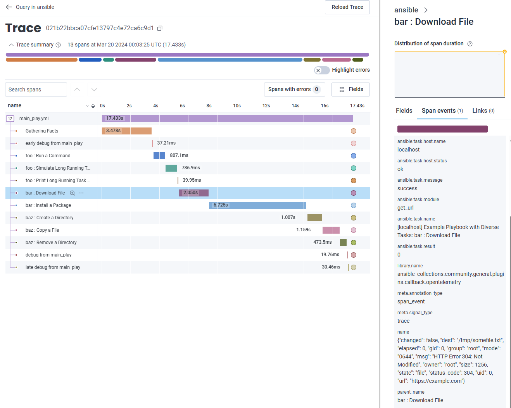
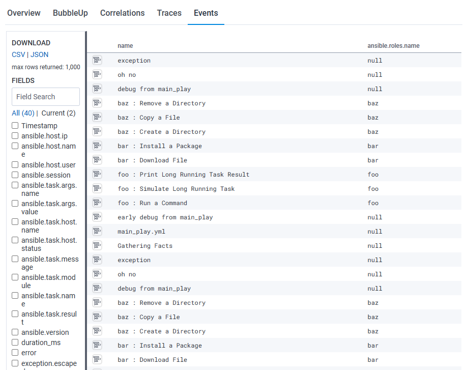
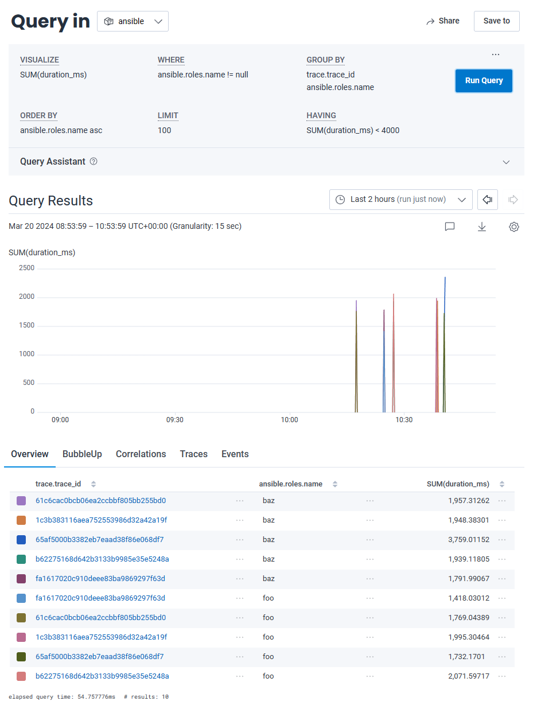

# Ansible Observability Example

## Overview

The purpose of this repo is to create a working example of an ansible play which pushes traces to honeycomb backend for
observability purposes.

## Running

I am building this on windows and since ansible doesn't work being run from windows we instead need to run it in a linux
container. To do this you can just mount this project into the container. I have included a docker file that will
install
ansible and the OTEL packages needed to make this work.

### build docker and run the container

```shell
docker build -t myansible .
docker run -it -v $(pwd):/local -w /local myansible sh
```

### setup the env vars

We need to tell the OTEL package where to ship our traces to. We will directly export these to the backend instead of a
collector

```shell
export OTEL_EXPORTER_OTLP_ENDPOINT=https://api.honeycomb.io/
export OTEL_EXPORTER_OTLP_HEADERS="x-honeycomb-team=hcaik_01hs6b0zv51w28xxxxxxxxxxxxxxxxxxxxxx8wy5w2h0dhhr3wry9"
export OTEL_SERVICE_NAME=ansible

export ANSIBLE_CALLBACKS_ENABLED=community.general.opentelemetry

```

To run the playbook

```shell
ansible-playbook main_play.yml
```

## Ansible output

the ansible output is just the standard ansible view however the spans will be sent behind the scenese and enriched with
info like the tasks args and its output.

```shell
root@8eb1fcf2b8c6:/local# ansible-playbook main_play.yml 
[WARNING]: No inventory was parsed, only implicit localhost is available
[WARNING]: provided hosts list is empty, only localhost is available. Note that the implicit localhost does not match 'all'

PLAY [Example Playbook with Diverse Tasks] ***************************************************************************************************************************************************************

TASK [Gathering Facts] ***********************************************************************************************************************************************************************************
ok: [localhost]

TASK [early debug from main_play] ************************************************************************************************************************************************************************
ok: [localhost] => {
    "msg": "This is a debug message"
}

TASK [foo : Run a Command] *******************************************************************************************************************************************************************************
changed: [localhost]

TASK [foo : Simulate Long Running Task] ******************************************************************************************************************************************************************
changed: [localhost]

TASK [foo : Print Long Running Task Result] **************************************************************************************************************************************************************
ok: [localhost] => {
    "msg": "Long running task completed with result: {'failed': 0, 'started': 1, 'finished': 0, 'ansible_job_id': 'j45543076077.2339', 'results_file': '/root/.ansible_async/j45543076077.2339', 'changed': True}"
}

TASK [bar : Download File] *******************************************************************************************************************************************************************************
ok: [localhost]

TASK [bar : Install a Package] ***************************************************************************************************************************************************************************
ok: [localhost]

TASK [baz : Create a Directory] **************************************************************************************************************************************************************************
changed: [localhost]

TASK [baz : Copy a File] *********************************************************************************************************************************************************************************
ok: [localhost]

TASK [baz : Remove a Directory] **************************************************************************************************************************************************************************
changed: [localhost]

TASK [debug from main_play] ******************************************************************************************************************************************************************************
ok: [localhost] => {
    "msg": "This is a debug message"
}

TASK [late debug from main_play] *************************************************************************************************************************************************************************
ok: [localhost] => {
    "msg": "This is a debug message"
}

PLAY RECAP ***********************************************************************************************************************************************************************************************
localhost                  : ok=12   changed=4    unreachable=0    failed=0    skipped=0    rescued=0    ignored=0
```

## Traces

What is nice is we can not only see the run time in a waterfall chart but we can actually see things like that arguments
that were passed to the task as well as the task results using the span event related to the span



## derived role values

disappointingly ansible OTEL callback doesn't start a span for each role and put the roles tasks as sub spans. This is
because ansible doesn't provide any callback methods for when a role starts since a role in its self doesnt do anything,
it's just a logical way to group resources together.

While I have an idea that this could be managed in the same way the `profile_roles` call back works, for now we can use
honeycombs derived fields to extract the role name. The below is created as a derived field in the dataset to capture
the role name from the actual task name. It will look for names that start with a word char then anything thats not a
colon
until it finds a colon and will set what it found as the role. If the pattern didnt match then it will set the value as
null

```
IF(
  REG_MATCH($name, `^(\w[^:]*?)\s*?:`),
  REG_VALUE($name, `^(\w[^:]*?)\s*?:`),
  "null"
)
```



We can then use this to calculate things like the actual total time for the role in a given trace. In the below example,
the query is searching for all events where the `ansible.roles.name` is not null, grouping by the trace_id and role name
and then showing only those roles that took less than 4 seconds.



In the first example we can see it took 1,957 seconds for the roles tasks. if we look at each of tasks in that trace
that have the baz role we can see this reports correctly

| duration_ms | name                     | ansible.roles.name |
|-------------|--------------------------|--------------------|
| 	424.45319  | baz : Remove a Directory | baz                |
| 	960.2306   | baz : Copy a File        | baz                |
| 	572.62884  | baz : Create a Directory | baz                |
